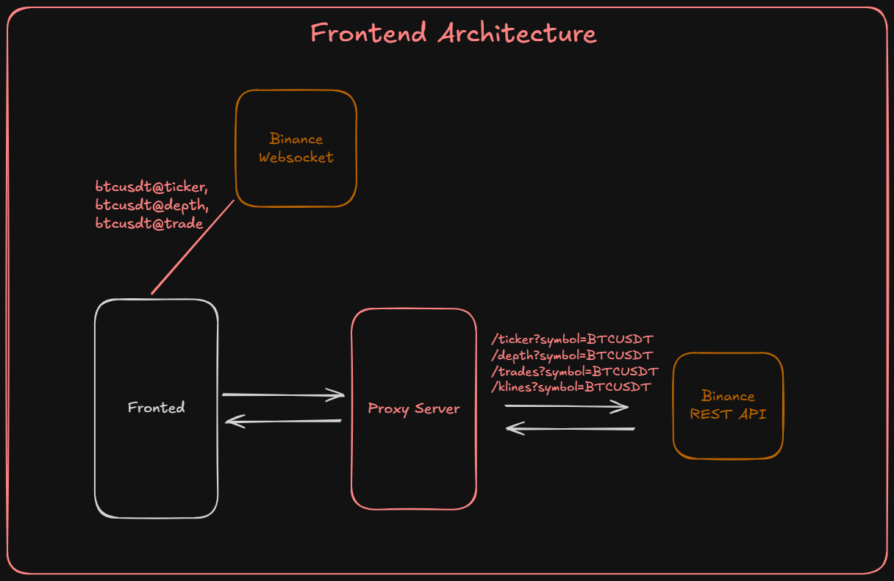

# 🚀 Trado

<p align="center">
  <b>A Personal Project to Build a Real-Time Cryptocurrency Exchange from Scratch</b>
</p>

<p align="center">
Building an exchange from the ground up to learn real-time systems, matching engines, WebSockets, and scalable backend architecture.
</p>

---

## 📖 About the Project

Trado is a personal engineering project where I'm building a cryptocurrency exchange from scratch to understand how modern trading platforms work under the hood.

Instead of only recreating the trading interface, the goal is to implement the core infrastructure that powers an exchange, including:

* API Server
* Matching Engine
* WebSocket Server
* Database Processor
* Real-time Order Books
* Trade Execution
* Event-driven Architecture

The project is being developed publicly, with each milestone shared on LinkedIn and X as the architecture evolves.

---

# ✨ Current Status

> **Version:** `v0.1.0`

✅ Frontend Completed

The current version uses Binance's REST API and WebSocket Streams to provide a real-time trading experience while the backend is under development.

---

# 🎥 Demo

## Demo Video

A demonstration of the real-time trading dashboard including market data, candlestick charts, order book, live trades, and swap interface.

<video src="docs/media/TRADO_01.mp4" controls width="800"></video>
---

# 📸 Screenshots

## Markets Page

> Add Screenshot Here

---

## Trading Page

> Add Screenshot Here

---

## Order Book & Live Trades

> Add Screenshot Here

---

# ✨ Features

## 📈 Markets

* Live cryptocurrency prices
* 24-hour price change
* Daily High / Low
* Trading Volume
* Real-time market updates

Supported pairs include:

* BTCUSDT
* ETHUSDT
* SOLUSDT
* XRPUSDT
* BNBUSDT
* NEARUSDT
* DOGEUSDT
* LTCUSDT
* ADAUSDT

---

## 💹 Trading

* Interactive Kline (Candlestick) Chart
* Live Ticker
* Real-Time Order Book
* Live Trade Feed
* Buy / Sell Interface

---

## ⚡ Real-Time Data

* Binance REST API
* Binance WebSocket Streams
* Automatic Market Synchronization

---

# 🛠 Tech Stack

## Frontend

* Next.js
* React
* TypeScript
* Tailwind CSS

## Charts

* TradingView Lightweight Charts

## Real-Time

* Binance REST API
* Binance WebSocket API

## Backend (Upcoming)

* Node.js
* TypeScript
* PostgreSQL
* Redis
* WebSockets

---

# 🏗️ Current Architecture


                

---

# 🚀 Target Architecture

The long-term goal is to replace Binance completely with infrastructure built from scratch.


# 🚀 Getting Started

## Clone the Repository

```bash
git clone https://github.com/JayBhende05/Trado.git

cd trado
```

---

# 📦 Running the Frontend

Install dependencies

```bash
npm install
```

Start the development server

```bash
npm run dev
```

Frontend will be available at

```
http://localhost:3000
```

---

# 🌐 Running the Proxy Server

Navigate to the proxy server directory.

Compile the TypeScript project

```bash
npx tsx -b
```

Then start the proxy server

```bash
node dist/server.js
```

The proxy server forwards requests and streams real-time market data from Binance.

---

# 🗺️ Roadmap

## ✅ Completed

* Frontend UI
* Markets Page
* Trading Page
* Binance REST Integration
* Binance WebSocket Integration
* Candlestick Charts
* Order Book
* Trade Feed
* Buy / Sell Interface

---

## 🚧 In Progress

* API Server
* Matching Engine
* WebSocket Server
* Database Processor

---

## 📅 Planned

* User Authentication
* User Balances
* Market Orders
* Limit Orders
* Trade History
* Portfolio Dashboard
* Docker Support
* Kubernetes Deployment

---

# 📚 Build in Public

I'm documenting the complete journey of building Trado on LinkedIn and X.

### Series

* ✅ Part 1 — Frontend with Binance APIs & WebSockets
* 🚧 Part 2 — System Architecture
* ⏳ Part 3 — API Server
* ⏳ Part 4 — Matching Engine
* ⏳ Part 5 — WebSocket Server
* ⏳ Part 6 — Database Processor
* ⏳ Part 7 — Complete Exchange Demo

Each post covers the architecture, implementation, and engineering decisions behind every component.

---

# 🎯 Why Trado?

Most exchange clones stop at the frontend.

With Trado, my goal is to understand what happens behind every trade by building the core systems myself.

This project focuses on:

* Real-time systems
* System Design
* Event-driven Architecture
* Order Matching Algorithms
* WebSockets
* High-performance Backend Development
* Scalable Software Architecture

---

# 🤝 Contributing

This is currently a personal learning project.

However, suggestions, discussions, and constructive feedback are always welcome.

Feel free to open an issue if you'd like to share ideas or improvements.

---

# 👨‍💻 About Me

Hi, I'm **Jay Bhende**.

I'm a Full Stack Developer passionate about backend engineering, distributed systems, and building real-time applications.

Trado is one of the projects I'm using to deepen my understanding of how production-grade systems are designed and implemented.

If you'd like to connect, feel free to reach out.

* LinkedIn: https://www.linkedin.com/in/jaybhende/
* X: https://x.com/JayBhende05
* GitHub: https://github.com/JayBhende05

---

# ⭐ Support

If you found this project interesting, consider giving it a **Star ⭐**.

It helps others discover the project and motivates me to keep building and sharing the journey.

---

# 📄 License

This project is licensed under the **MIT License**.
