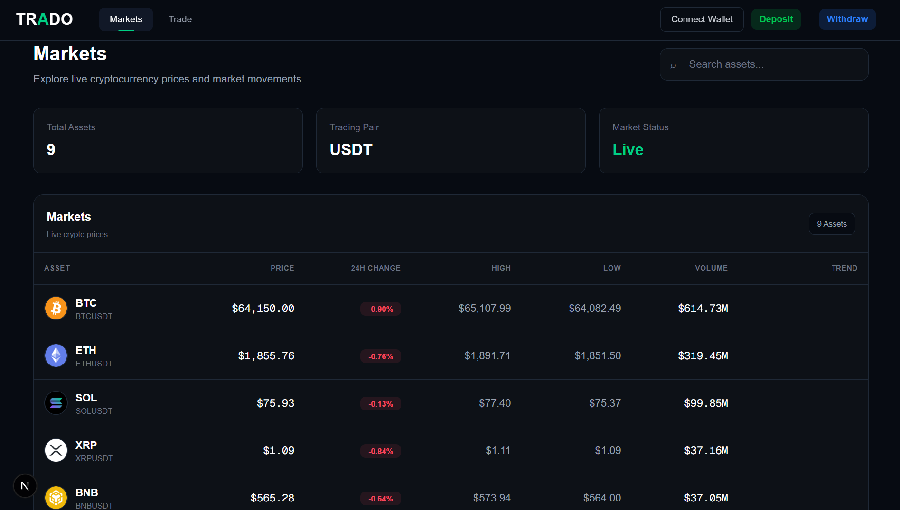
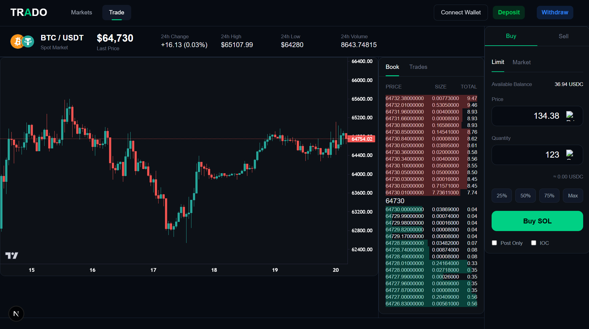
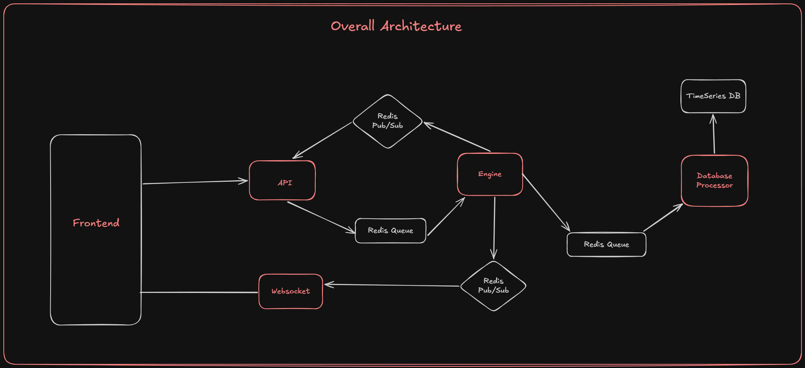

# 🚀 Trado

<p align="center">
  
  
  
  
  
  
</p>

<p align="center">
  <strong>A Cryptocurrency Exchange Built from Scratch</strong>
</p>

<p align="center">
Learn how modern cryptocurrency exchanges work by implementing every core component—from order placement and matching to trade execution, persistence, and real-time market updates.
</p>

<p align="center">
  <a href="#-features">Features</a> •
  <a href="#-architecture">Architecture</a> •
  <a href="#-getting-started">Getting Started</a> •
  <a href="#-roadmap">Roadmap</a> •
  <a href="#-build-in-public">Build in Public</a>
</p>

---

# 📖 About

**Trado** is a personal engineering project focused on understanding the internals of modern cryptocurrency exchanges by building one entirely from scratch.

Rather than recreating only the trading interface, the goal is to implement the distributed backend infrastructure that powers real-world exchanges.

This project explores:

- ⚙️ Matching Engine Design
- 📡 Event-Driven Architecture
- 🔄 Redis Pub/Sub Communication
- 📬 Redis Queue Processing
- 🌐 WebSocket Infrastructure
- 📊 Time-Series Data Storage
- 📈 Real-Time Order Books
- 💹 Trade Execution Pipeline
- 🏗 Distributed Backend Systems

Every major milestone has been documented publicly, explaining the architecture, engineering decisions, and implementation details behind each component.

---

# 📑 Table of Contents

- [✨ Features](#-features)
- [🎥 Demo](#-demo)
- [📸 Screenshots](#-screenshots)
- [🏗 Architecture](#-architecture)
- [🛠 Tech Stack](#-tech-stack)
- [📂 Project Structure](#-project-structure)
- [🚀 Getting Started](#-getting-started)
- [📦 Releases](#-releases)
- [🗺 Roadmap](#-roadmap)
- [📚 Build in Public](#-build-in-public)
- [🤝 Contributing](#-contributing)
- [👨‍💻 About Me](#-about-me)
- [📄 License](#-license)

---

# 🚀 Current Status

> **Latest Release:** **v1.0.0** — Core Exchange Architecture

## ✅ Completed

| Component | Status |
|-----------|--------|
| Frontend Trading Interface | ✅ |
| API Server | ✅ |
| Matching Engine | ✅ |
| Redis Pub/Sub | ✅ |
| Redis Queue Processing | ✅ |
| Database Processor | ✅ |
| WebSocket Server | ✅ |
| TimescaleDB Integration | ✅ |
| Buy & Sell Order Execution | ✅ |
| Real-Time Order Book | ✅ |
| Live Trade Streaming | ✅ |
| Event-Driven Architecture | ✅ |

---

# 📦 Releases

## 🚀 v1.0.0 — Core Exchange Architecture (Latest)

This release contains the complete exchange backend including:

- ✅ Frontend Trading Interface
- ✅ API Server
- ✅ Matching Engine
- ✅ Redis Pub/Sub
- ✅ Redis Queues
- ✅ Database Processor
- ✅ TimescaleDB
- ✅ WebSocket Server
- ✅ Real-Time Order Execution
- ✅ Live Order Book Updates
- ✅ Live Trade Streaming

> Recommended for anyone interested in understanding the complete exchange architecture.

---

## 📱 v0.1.0 — Frontend Prototype

The initial release showcasing the trading interface powered by Binance APIs.

Includes:

- Next.js Frontend
- Binance REST API
- Binance WebSocket API
- Markets Dashboard
- Trading Page
- Live Order Book
- Live Trades
- TradingView Charts

> If you're only interested in the frontend implementation, download **v0.1.0**.

# 🎥 Demo

## 🔄 End-to-End Exchange Demo

> **Coming Soon**
>
> A complete walkthrough showcasing the entire trade lifecycle—from placing an order to matching, execution, database persistence, and real-time updates.

<!-- Replace with your latest demo video -->

---

## 💻 Frontend Demo

https://github.com/user-attachments/assets/7b0026eb-997b-4b08-bc40-f81420e10885

---

# 📸 Screenshots

## 📊 Markets Dashboard

Browse available trading pairs with live market information.



---

## 📈 Trading Interface

Professional trading interface with an order book, live trades, TradingView charts, and order placement.



---

# ✨ Features

Trado is designed to mimic the architecture of a real cryptocurrency exchange by implementing every major backend component from scratch.

## 💹 Trading Engine

- ✅ Place Buy Orders
- ✅ Place Sell Orders
- ✅ Price-Time Priority Matching
- ✅ Partial Order Execution
- ✅ Full Order Execution
- ✅ Trade Generation
- ✅ Automatic Balance Updates
- ✅ Real-Time Trade Matching

---

## ⚡ Real-Time Infrastructure

- ✅ Live Order Book
- ✅ Incremental Depth Updates
- ✅ Live Trade Feed
- ✅ WebSocket Streaming
- ✅ Redis Pub/Sub Messaging
- ✅ Low-Latency Market Updates

---

## 🏗 Backend Services

- ✅ API Server
- ✅ Matching Engine
- ✅ Database Processor
- ✅ Redis Queue Workers
- ✅ Event-Driven Communication
- ✅ TimescaleDB Integration
- ✅ Asynchronous Persistence

---

## 💻 Frontend

- ✅ Markets Dashboard
- ✅ Professional Trading Interface
- ✅ TradingView Lightweight Charts
- ✅ Live Order Book
- ✅ Live Trades
- ✅ Responsive Design
- ✅ Real-Time Price Updates

---

## 🔥 Highlights

- 🚀 Event-driven architecture
- ⚡ High-speed order matching
- 📡 Real-time market data streaming
- 🧩 Loosely coupled backend services
- 📊 Time-series trade storage using TimescaleDB
- 🔄 Redis-powered messaging and queues
- 🌐 WebSocket-based live updates
- 📈 Production-inspired exchange architecture

---

# 🛠 Tech Stack

## 🎨 Frontend

| Technology | Purpose |
|------------|---------|
| **Next.js** | React Framework |
| **React** | UI Library |
| **TypeScript** | Type Safety |
| **Tailwind CSS** | Styling |
| **TradingView Lightweight Charts** | Financial Charts |

---

## ⚙️ Backend

## ⚙️ Backend

| Technology | Purpose |
|------------|---------|
| **Node.js** | Runtime for backend services |
| **TypeScript** | Backend application development |
| **Redis** | Pub/Sub messaging and queue processing |
| **PostgreSQL** | Primary relational database |
| **TimescaleDB** | Time-series storage for trades and market data |
| **WebSockets** | Real-time market data streaming |
| **Docker** | Containerized local infrastructure and service orchestration |

---

## 🏛 Infrastructure

| Component | Responsibility |
|-----------|----------------|
| API Server | Accepts and validates client requests |
| Matching Engine | Matches buy and sell orders |
| Redis Queue | Handles asynchronous processing |
| Redis Pub/Sub | Broadcasts exchange events |
| Database Processor | Persists trades and orders |
| WebSocket Server | Streams live market updates |
| TimescaleDB | Stores historical market data |

---

# 📊 What You'll Learn

Building Trado provides hands-on experience with:

- Distributed Systems
- Matching Engine Design
- Event-Driven Architecture
- Queue-Based Processing
- WebSocket Communication
- Time-Series Databases
- High-Performance Backend Development
- Real-Time Trading Infrastructure
- Financial System Design


# 🏗 Architecture

Trado follows a **distributed, event-driven architecture** where each service has a single responsibility and communicates asynchronously through Redis. This design keeps components loosely coupled, scalable, and easier to maintain.

## Overall System Architecture



---

## 🧩 Core Components

### 🌐 API Server

The API Server is the entry point for all client requests.

**Responsibilities**

- Validate incoming requests
- Authenticate users *(planned)*
- Verify balances
- Publish orders to the Redis Queue
- Return immediate acknowledgements

---

### ⚡ Matching Engine

The heart of the exchange.

The Matching Engine continuously consumes orders from the queue and matches buy and sell orders using **Price-Time Priority**.

**Responsibilities**

- Process incoming orders
- Match compatible buy and sell orders
- Support partial and complete fills
- Generate trades
- Publish execution events

---

### 📬 Redis Queue

Acts as the communication layer between the API Server and the Matching Engine.

**Benefits**

- Decouples services
- Handles traffic spikes
- Enables asynchronous processing
- Prevents blocking API requests

---

### 📡 Redis Pub/Sub

After a trade is executed, the Matching Engine broadcasts events using Redis Pub/Sub.

These events are consumed independently by downstream services.

**Consumers**

- Database Processor
- WebSocket Server

---

### 💾 Database Processor

Consumes trade events and persists them into the database.

**Responsibilities**

- Store executed trades
- Save order history
- Record market data
- Insert candle data *(future)*

---

### 🌍 WebSocket Server

Streams live exchange updates to connected clients.

Clients receive updates instantly without polling.

**Streams**

- Live Order Book
- Trade Feed
- Market Updates
- Price Changes

---

### 📊 TimescaleDB

TimescaleDB stores historical market data optimized for time-series workloads.

Examples include:

- Trades
- Candlesticks
- Historical Prices
- Market Statistics

---
# 📂 Project Structure

```text
Trado
│
├── api-server/              # REST API for order placement and request validation
│
├── engine-server/           # Core matching engine responsible for trade execution
│
├── orderbook-server/        # Maintains and serves the real-time order book
│
├── ws-server/               # WebSocket server for streaming market updates
│
├── database-processor/      # Persists trades, orders, and market data asynchronously
│
├── proxy-server/            # Routes WebSocket connections and manages client communication
│
├── frontend/                # Next.js trading interface
│
├── docker/                  # Docker Compose and infrastructure configuration
│
├── docs/
│   ├── architecture/        # System architecture diagrams
│   └── screenshots/         # Project screenshots
│
├── README.md
└── LICENSE
```

---

## 📁 Directory Overview

| Directory | Description |
|-----------|-------------|
| **api-server** | Validates client requests, performs business logic, and publishes orders to the queue. |
| **engine-server** | Implements the matching engine using Price-Time Priority and generates trade events. |
| **orderbook-server** | Maintains the in-memory order book and provides order book snapshots/updates. |
| **ws-server** | Streams live order book updates, trades, and market events to connected clients. |
| **database-processor** | Consumes trade events asynchronously and persists them to TimescaleDB. |
| **proxy-server** | Handles WebSocket proxying, routing, and connection management. |
| **frontend** | Next.js application providing the trading interface and market dashboard. |
| **docker** | Docker Compose files and container configuration for Redis, PostgreSQL, and TimescaleDB. |
| **docs** | Architecture diagrams, screenshots, and project documentation. |

---

# 🔄 Order Execution Flow

The following diagram illustrates how an order travels through the system.


```text
           User
             │
             ▼
      API Server
             │
             ▼
       Redis Queue
             │
             ▼
     Matching Engine
             │
     Trade Execution
             │
             ▼
      Redis Pub/Sub
        │        │
        │        │
        ▼        ▼
 Database      WebSocket
 Processor      Server
        │        │
        ▼        ▼
   TimescaleDB  Connected Clients
```

---

## 📈 Step-by-Step Flow

### 1. User Places an Order

The client submits a Buy or Sell order through the frontend.

↓

### 2. API Validation

The API Server validates the request and publishes it to the Redis Queue.

↓

### 3. Queue Processing

The Matching Engine consumes the next order from the queue.

↓

### 4. Order Matching

The engine compares the incoming order against existing orders in the order book using **Price-Time Priority**.

Possible outcomes:

- Full Match
- Partial Match
- No Match (added to order book)

↓

### 5. Trade Execution

Once a match is found:

- Trades are generated
- Quantities are updated
- Order statuses change

↓

### 6. Event Publication

The Matching Engine publishes trade events through Redis Pub/Sub.

↓

### 7. Independent Consumers

Two independent services consume these events:

- **Database Processor** → Persists data
- **WebSocket Server** → Broadcasts updates

↓

### 8. Client Updates

Connected users instantly receive:

- Updated Order Book
- New Trades
- Latest Prices
- Market Activity

---

# 📡 Event-Driven Communication

Every service communicates using events instead of direct service-to-service calls.

```text
Order Created
      │
      ▼
Redis Queue
      │
      ▼
Matching Engine
      │
      ▼
Trade Executed Event
      │
      ▼
Redis Pub/Sub
   │          │
   ▼          ▼
Database   WebSocket
Processor    Server
```

### Advantages

- ✅ Loose coupling
- ✅ Independent services
- ✅ Easier horizontal scaling
- ✅ Better fault isolation
- ✅ High throughput
- ✅ Cleaner architecture

---

# 🎯 Design Principles

The architecture is inspired by production-grade exchange systems and follows a few key principles:

- **Single Responsibility** — Each service has one well-defined job.
- **Asynchronous Processing** — Orders are processed through queues instead of blocking requests.
- **Event-Driven Communication** — Services communicate via published events rather than direct calls.
- **Scalability** — Components can be scaled independently based on load.
- **Extensibility** — New consumers (analytics, notifications, risk engine, etc.) can subscribe to events without modifying existing services.

# 🚀 Getting Started

Follow these steps to set up Trado locally.

## Prerequisites

Make sure you have the following installed:

| Software | Recommended Version |
|----------|----------------------|
| Node.js | 20+ |
| npm | 10+ |
| Redis | Latest |
| PostgreSQL | 16+ |
| TimescaleDB | Latest |
| Git | Latest |

You can verify your installation using:

```bash
node -v
npm -v
redis-server --version
psql --version
```

---
# 🚀 Getting Started

Follow these steps to run Trado locally.

The project uses multiple independent services along with Docker-based infrastructure.

---

# 📥 Clone the Repository

```bash
git clone https://github.com/JayBhende05/Trado.git

cd Trado
```

---

# 📦 Install Dependencies

Each service has its own `package.json`, so dependencies need to be installed separately.

Run `npm install` inside each directory:

## Frontend

```bash
cd frontend

npm install
```

---

## API Server

```bash
cd api-server

npm install
```

---

## Matching Engine

```bash
cd engine-server

npm install
```

---

## WebSocket Server

```bash
cd ws-server

npm install
```

---

## Database Processor

```bash
cd database-processor

npm install
```

---

## Order Book Server

```bash
cd orderbook-server

npm install
```

---

## Proxy Server

```bash
cd proxy-server

npm install
```

---


# 🐳 Start Infrastructure Services

Trado uses Docker to run the required infrastructure locally:

- Redis
- TimescaleDB
- PostgreSQL
- pgAdmin

Navigate to the Docker directory:

```bash
cd docker
```

Start all containers:

```bash
docker compose up -d
```

Verify running containers:

```bash
docker ps
```

---

# 🗄 Database Initialization

After starting Docker services, initialize the database.

Navigate to the database processor:

```bash
cd database-processor
```

Seed the database:

```bash
npm run seed:db
```

Start the database processor:

```bash
npm run dev
```

The database processor listens for trade events and asynchronously persists data into TimescaleDB.

---

# ▶️ Start Backend Services

Each backend service runs independently.

Open a separate terminal for each service.

---

## 🌐 API Server

```bash
cd api-server

npm run dev
```

Responsibilities:

- Receives client requests
- Validates orders
- Publishes orders for processing

---

## ⚡ Matching Engine

```bash
cd engine-server

npm run dev
```

Responsibilities:

- Processes incoming orders
- Matches buy and sell orders
- Generates trades

---

## 🌍 WebSocket Server

```bash
cd ws-server

npm run dev
```

Responsibilities:

- Streams live order book updates
- Sends real-time trade updates
- Maintains client connections

---

# 📈 Start Frontend

Run the frontend application:

```bash
cd frontend

npm run dev
```

The application will be available at:

```text
http://localhost:3000
```

---

# 🔄 Complete Startup Flow

The recommended startup order is:

```text
1. Docker Infrastructure

docker compose up -d

        │
        ▼

2. Database Processor

npm run seed:db
npm run dev

        │
        ▼

3. API Server

npm run dev

        │
        ▼

4. Matching Engine

npm run dev

        │
        ▼

5. WebSocket Server

npm run dev

        │
        ▼

6. Frontend

npm run dev
```

---

# 🧪 Verifying Everything

Once all services are running, the complete exchange flow should look like:

```text
                 Frontend
                    │
                    ▼
               API Server
                    │
                    ▼
              Redis Queue
                    │
                    ▼
            Matching Engine
                    │
                    ▼
             Trade Execution
                    │
                    ▼
             Redis Pub/Sub
              │          │
              ▼          ▼
 Database Processor   WebSocket Server
              │          │
              ▼          ▼
        TimescaleDB   Connected Clients
```

If everything is configured correctly:

- ✅ Docker containers are running
- ✅ Database is seeded successfully
- ✅ Orders can be placed
- ✅ Matching Engine processes trades
- ✅ Trades are persisted asynchronously
- ✅ Order Book updates in real time
- ✅ Live trades stream through WebSockets

---

# 🛑 Stopping the Project

Stop all Docker containers:

```bash
cd docker

docker compose down
```

To remove containers and volumes:

```bash
docker compose down -v
```

---

# 🐳 Docker Services

The Docker environment provides:

| Service | Purpose |
|---------|---------|
| Redis | Queue processing and Pub/Sub messaging |
| TimescaleDB | Time-series storage for trades and market data |
| PostgreSQL | Relational database storage |
| pgAdmin | Database management interface |

---

# 🐳 Future Deployment

Future improvements planned:

- Docker images for all services
- Full Docker Compose application setup
- Kubernetes deployment
- CI/CD pipelines
- Monitoring with Prometheus
- Grafana dashboards
- Centralized logging
- Horizontal scaling

# 🚀 Production Roadmap

Future deployment targets include:

- Docker
- Kubernetes
- NGINX
- GitHub Actions
- CI/CD Pipelines
- Monitoring with Prometheus
- Grafana Dashboards
- Centralized Logging
- Horizontal Scaling
- Load Balancing

---


# 🗺 Roadmap

Trado is an evolving project focused on building a production-inspired cryptocurrency exchange from the ground up. Below is the current progress and upcoming milestones.

## ✅ Completed

- [x] Frontend Trading Interface
- [x] Markets Dashboard
- [x] API Server
- [x] Matching Engine
- [x] Redis Pub/Sub
- [x] Redis Queue Processing
- [x] Database Processor
- [x] TimescaleDB Integration
- [x] WebSocket Server
- [x] Buy/Sell Order Placement
- [x] Price-Time Priority Matching
- [x] Partial Order Execution
- [x] Real-Time Order Book
- [x] Live Trade Streaming
- [x] End-to-End Exchange Flow

---

## 🚧 In Progress

- [ ] User Authentication
- [ ] JWT-based Authorization
- [ ] Portfolio Management
- [ ] User Wallets
- [ ] Trade History
- [ ] Order History
- [ ] Order Cancellation

---

## 🔮 Planned Features

### Trading

- [ ] Limit Orders
- [ ] Market Orders
- [ ] Stop Orders
- [ ] Stop-Limit Orders
- [ ] OCO Orders
- [ ] Iceberg Orders

### Backend

- [ ] Risk Management Engine
- [ ] Rate Limiting
- [ ] Notification Service
- [ ] Analytics Service
- [ ] Audit Logging
- [ ] API Versioning

### Infrastructure

- [ ] Docker Support
- [ ] Docker Compose
- [ ] Kubernetes Deployment
- [ ] CI/CD Pipeline
- [ ] Horizontal Scaling
- [ ] Monitoring with Prometheus
- [ ] Grafana Dashboards
- [ ] Distributed Logging

---

# 📚 Build in Public

One of the primary goals of Trado is not just to build an exchange, but to document the engineering journey behind it.

I've been sharing each milestone publicly, explaining the architecture, design decisions, and implementation details.

## 📖 Series

| Part | Topic | Status | Status |
|------|-------|--------|--------|
| Part 1 | Frontend Prototype | ✅ |[Watch Video](https://www.linkedin.com/posts/jaybhende_buildinpublic-react-nextjs-ugcPost-7484830909913915392-Z-kD/?utm_source=share&utm_medium=member_desktop&rcm=ACoAAEz1SdoB-kpMWVqFMu4dI7QS0MJNxGX9MA8)|
| Part 2 | Exchange Architecture | ✅ |[Watch Video](https://www.linkedin.com/posts/jaybhende_buildinpublic-systemdesign-backend-ugcPost-7485602453455941632-huCv/?utm_source=share&utm_medium=member_desktop&rcm=ACoAAEz1SdoB-kpMWVqFMu4dI7QS0MJNxGX9MA8) |
| Part 3 | Order Execution Pipeline | ✅ |[Watch Video](https://www.linkedin.com/posts/jaybhende_until-now-trado-could-display-live-market-ugcPost-7485732373255516162-Zs_5/?utm_source=share&utm_medium=member_desktop&rcm=ACoAAEz1SdoB-kpMWVqFMu4dI7QS0MJNxGX9MA8) |
| Part 4 | Database Persistence | ✅ |[Watch Video](https://www.linkedin.com/posts/jaybhende_buildinpublic-backenddevelopment-systemdesign-ugcPost-7486303898085830657-YA-a/?utm_source=share&utm_medium=member_desktop&rcm=ACoAAEz1SdoB-kpMWVqFMu4dI7QS0MJNxGX9MA8) |
| Part 5 | WebSocket Infrastructure | ✅ |[Watch Video](https://www.linkedin.com/posts/jaybhende_buildinpublic-backenddevelopment-systemdesign-ugcPost-7487000480443846656-0A-K/?utm_source=share&utm_medium=member_desktop&rcm=ACoAAEz1SdoB-kpMWVqFMu4dI7QS0MJNxGX9MA8) |
| Part 6 | End-to-End Exchange Flow | ✅ |[Watch Video](https://www.linkedin.com/posts/jaybhende_buildinpublic-backenddevelopment-systemdesign-ugcPost-7487566865020452864-Ps2s/?utm_source=share&utm_medium=member_desktop&rcm=ACoAAEz1SdoB-kpMWVqFMu4dI7QS0MJNxGX9MA8) |

Each article focuses on the "why" behind the implementation rather than simply presenting the code.

Topics include:

- Distributed Systems
- Event-Driven Architecture
- Matching Engine Design
- Redis Messaging
- WebSockets
- TimescaleDB
- Performance Optimization
- Software Architecture

---

# 🎯 Learning Goals

Trado is primarily a learning project aimed at understanding how modern exchanges operate behind the scenes.

Through this project, I'm exploring:

- High-Performance Backend Systems
- Distributed Systems
- Event-Driven Design
- Matching Engine Algorithms
- Time-Series Databases
- Real-Time Networking
- Financial System Design
- Low-Latency Architectures
- Scalable Software Engineering

The long-term vision is to evolve Trado into a feature-rich, production-inspired exchange while continuously learning and sharing the journey.

---

# 🤝 Contributing

Although Trado started as a personal learning project, contributions, ideas, and discussions are always welcome.

You can contribute by:

- Reporting bugs
- Suggesting new features
- Improving documentation
- Optimizing existing code
- Reviewing architecture decisions
- Sharing ideas and feedback

If you'd like to contribute:

1. Fork the repository.
2. Create a feature branch.
3. Commit your changes.
4. Open a Pull Request.

Please keep discussions respectful and constructive.

---

# 👨‍💻 About Me

Hi, I'm **Jay Bhende** 👋

I'm a Full Stack Developer with a strong interest in:

- Backend Engineering
- Distributed Systems
- System Design
- Real-Time Applications
- Scalable Software Architecture

Trado is one of the projects I'm building to deepen my understanding of production-grade backend systems and exchange infrastructure.

I enjoy documenting everything I learn and sharing it with the developer community.

---

## 🌐 Connect with Me

- **GitHub:** https://github.com/JayBhende05
- **LinkedIn:** https://www.linkedin.com/in/jaybhende/
- **X (Twitter):** https://x.com/JayBhende05

If you enjoy backend engineering, distributed systems, or system design, I'd love to connect!

---

# ⭐ Support the Project

If you found **Trado** helpful or interesting, consider giving the repository a **⭐ Star**.

It helps:

- Increase the project's visibility
- Motivate future development
- Support open-source learning
- Encourage more educational content

Every star is greatly appreciated!

---

# 📄 License

This project is licensed under the **MIT License**.

Feel free to use the project for learning and experimentation in accordance with the license terms.

---

<p align="center">
  <strong>Built with ❤️ while exploring distributed systems, matching engines, and real-time trading infrastructure.</strong>
</p>

<p align="center">
If you found this project helpful, don't forget to ⭐ the repository!
</p>